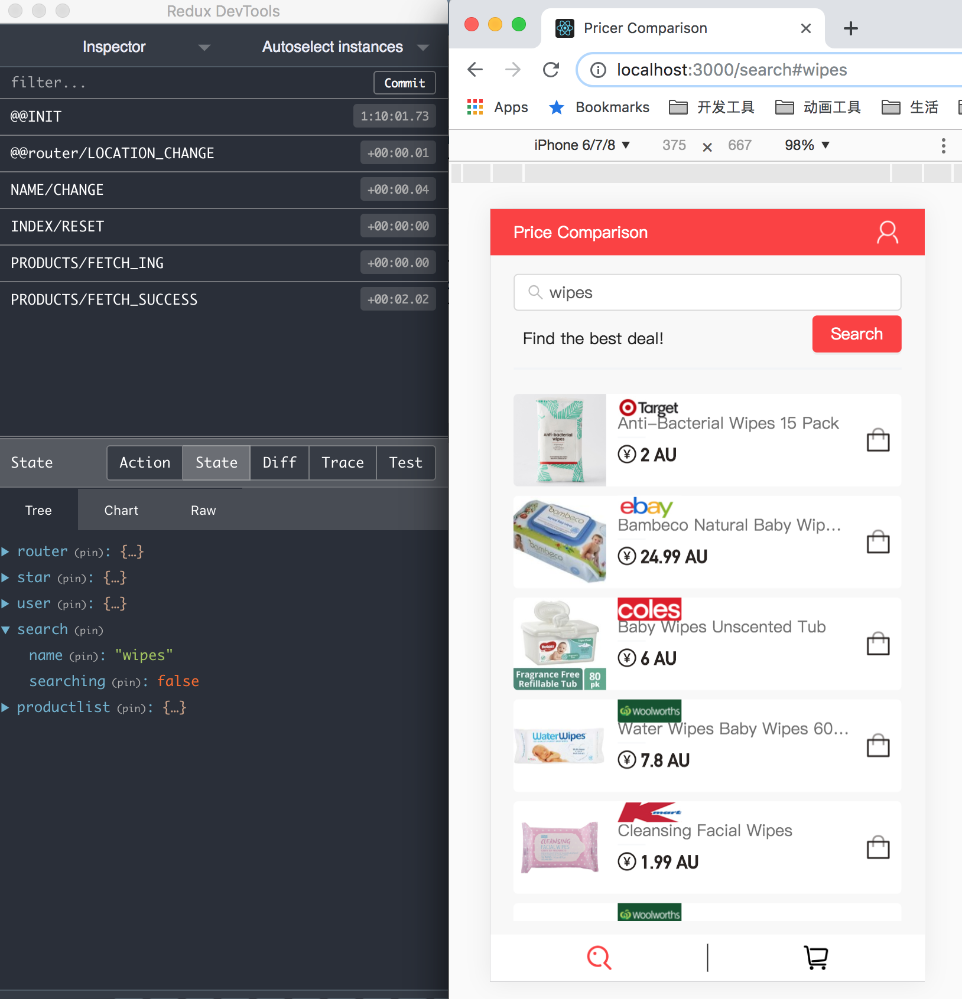
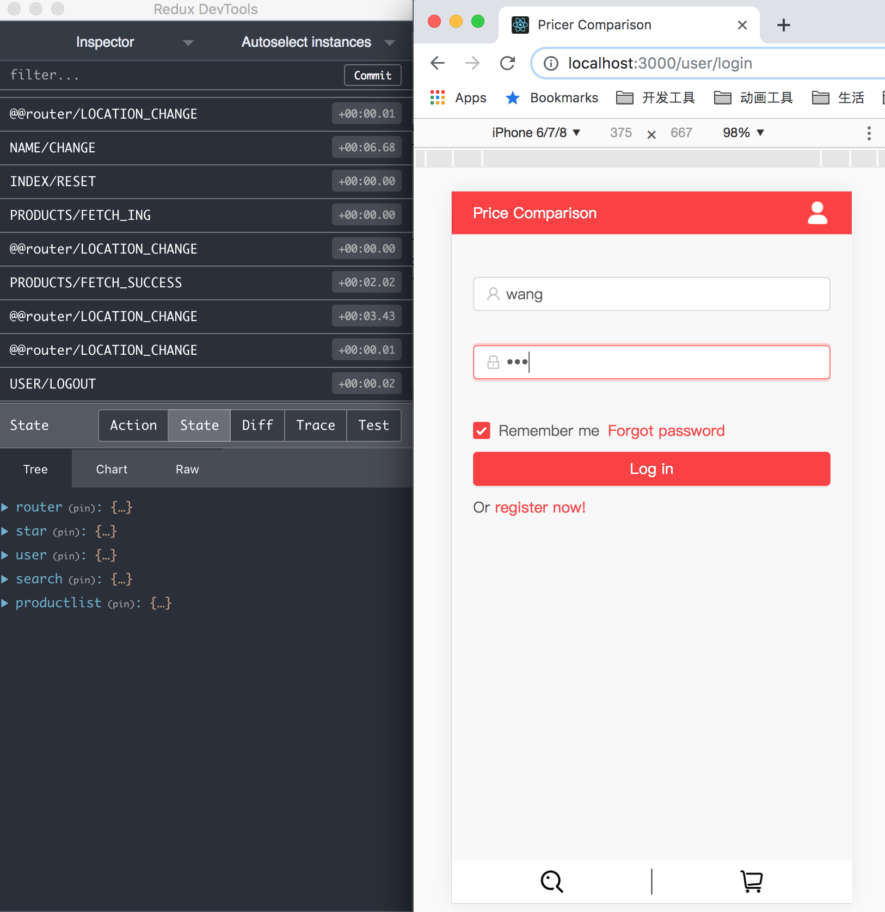
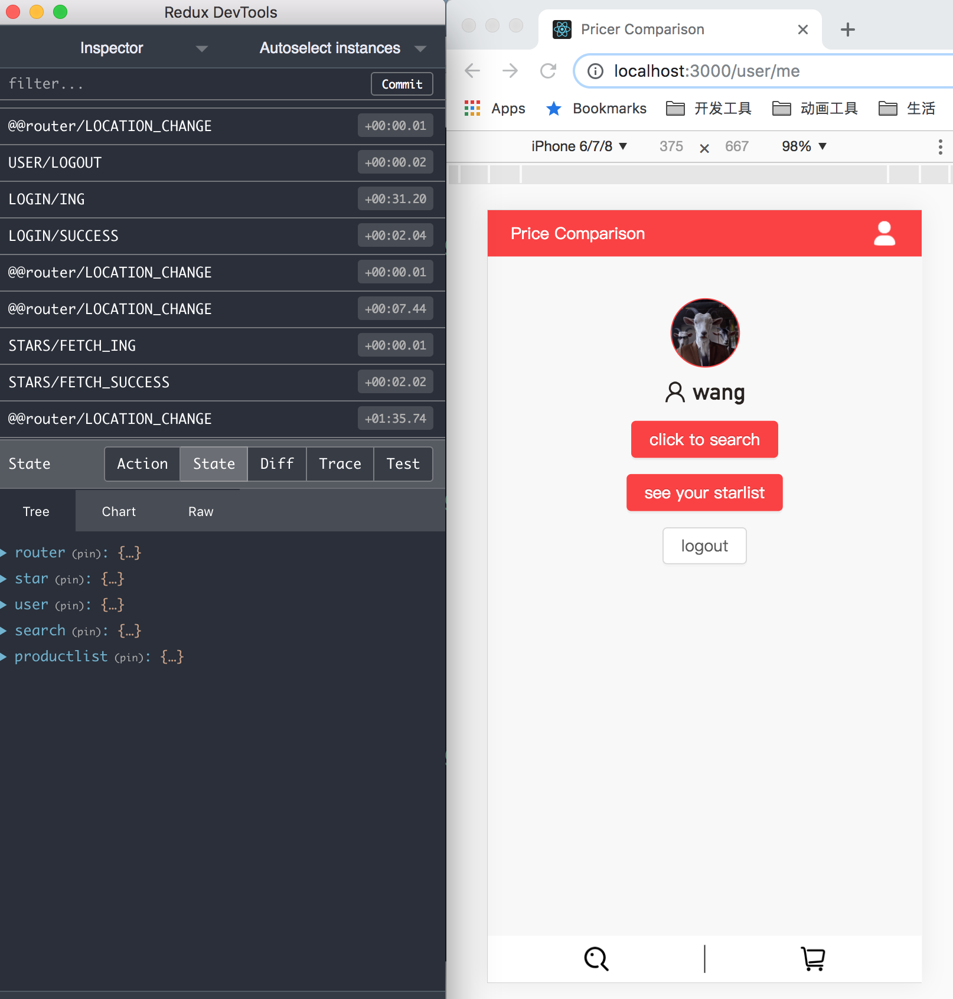
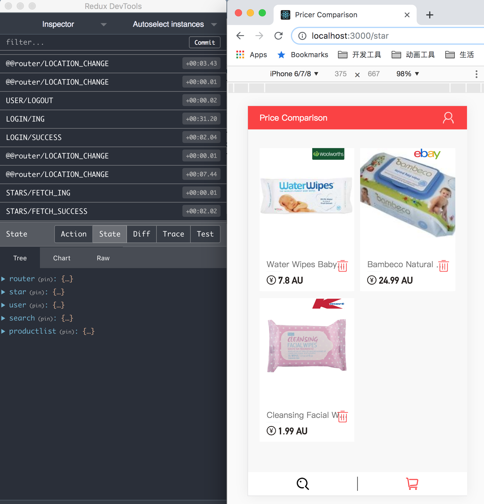

# A shopping web app based reactjs,redux and antd. 基于reactjs和redux的购物网站单页应用。
 This is a shopping web application developped with reactjs, redux-thunk, axios and antd. 这是一个使用reactjs,redux-thunk,axios 和 antd 等的单页网页应用。

**There is a another version of this application but developped with `redux-saga` and a better structure. See more info:(https://github.com/SoloistWang/reactjs-redux-saga)**
**还有另外一个使用`redux-saga`，文件夹架构优化的版本，欢迎参考。**

This project was developed with [Create React App].See more info (https://github.com/facebook/create-react-app).
项目使用`Create React App`构建。

## 1. Setting up. 项目开始。

Clone this repo and adjust details in `package.json`. Remove the `.git` directory and `git init` to start fresh.

克隆这个仓库，调整适合自己项目的`package.json`，移除`.git`文件并使用`git init`来初始化。

```bash
git clone https://github.com/SoloistWang/reactjs-redux-antd.git
```

## 2. Config package.json. 包配置。

- [`antd`] An enterprise-class UI design language. 企业级设计组件库。
- [`axios`] Promise based HTTP client. 处理HTTP请求。
- [`babel-plugin-import`] Modular import plugin for babe. Babel模块化导入组件。
- [`less`] The dynamic stylesheet language. 动态样式语言。
- [`react-app-rewired`] Tweak the create-react-app webpack config(s). 调整webpack配置。
- [`redux`]  a predictable state container for JavaScript apps. 应用状态容器
- [`react-router`] Declarative routing for React. 声明路由。

run `yarn install` to install the dependencies
运行 `yarn install` 来加载依赖包

```bash
yarn install
```

## 3. Directory structurem. 目录架构。
- `node_modules` Dependency package. 依赖包。
- `public`: Static source. 静态资源。
- `src`: App source. 项目源码。
  - `actions`: action creators and selectors. 定义动作和选择器。
  - `components`: static components. 静态组件。
  - `connectors`: component connectors. 连接器。
  - `pages`: views. 页面。
  - `reducers`: Receive antions then change state. 根据收到的动作改变状态。
  - `styles`: CSS, Less, and Icons. 样式文件。
  - `util`: Common and general functions. 基础和全局函数。
- config-overrides.js:Personal config. 个人设置。

## 4. Using `yarn` scripts. 使用 `yarn` 运行脚本。

- Start the app in development mode. 测试环境运行项目。
```bash
yarn start
```

- Compile the app. Files are emitted to `dist`. 编译项目，文件导出到`dist`文件夹。
```bash
yarn build 
```

- Runs tests. 运行测试脚本。
```bash
yarn test 
```

## 5. Running App. 运行应用。

Using the `redux-devtools-extension` first. 使用redux浏览器扩展插件。
Click to download the extension.
<a href="https://chrome.google.com/webstore/detail/redux-devtools/lmhkpmbekcpmknklioeibfkpmmfibljd"></a>

**Before running the app,visit this repo to get the backstage code and run the server, so you can use api.See more info https://github.com/SoloistWang/koa2-mongodb-jwt-server 运行应用之前建议下载后台代码并打开服务器，保证接口顺利运行。**

 Visit local website.
 http://localhost:3000/search

 ### test search page


 ### test login page


 ### test user page


 ### test star page



